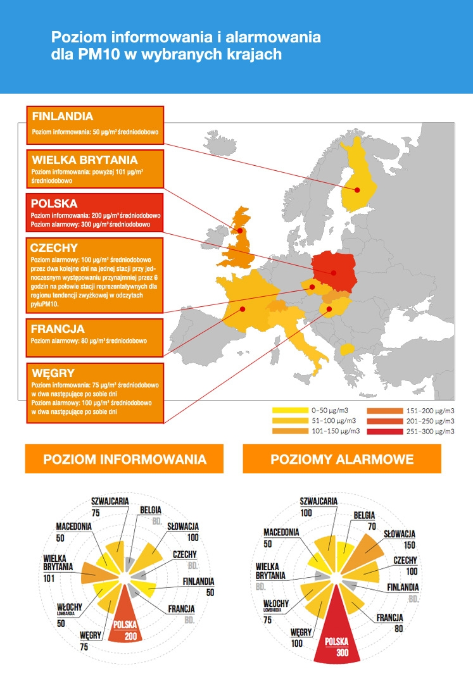

# 04_smog-tests
[Jest też dostępna polska wersja](README.pl.md)

Run existing test located inside `FizzBuzzTest`.
All test should pass. 
Note additional logs which appears during test.

# Exercise

We are developing service responsible for sending alarm types based on PM measurements.
Currently each country is having his own limits where given type should be send to people.
Take a look for given image:

Source: [https://www.polskialarmsmogowy.pl/polski-alarm-smogowy/smog/szczegoly,poziomy-informowania-i-alarmowe,19.html](https://www.polskialarmsmogowy.pl/polski-alarm-smogowy/smog/szczegoly,poziomy-informowania-i-alarmowe,19.html)

1. Go to `PmAlarmServiceTest` and run three tests.
2. As you can notice, for each test, there is `PmAlarmService` instance created.
3. Replace all 3 instance creations with one using right annotation (take a look for `FizzBuzzTest` for hints)
4. Create `timeExecution` variable which will be used to store time execution value for all tests run. Print it on the last step when all test has been executed.
5. Implement logic for 3 missing countries and cover it with proper tests.
6. We should see at this point, this design is going in the wrong direction.
7. Now when you have your code working and covered with proper number of tests, try to refactor this code, so you create new enum representing `PmCountryAlarmLevel` which stores all required information.

