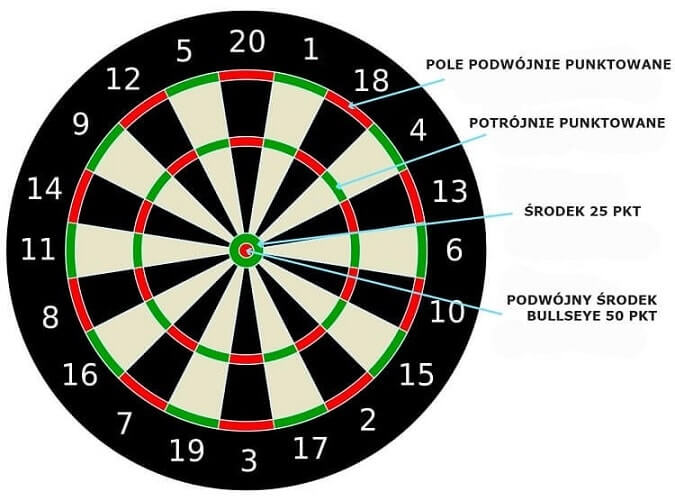

# 07_tdd-tests
[Jest też dostępna polska wersja](README.pl.md)

## Bowling Kata

The idea of this repository is to contain a minimal setup for executing the [Uncle Bob](https://twitter.com/unclebobmartin) famous [Bowling kata](http://butunclebob.com/ArticleS.UncleBob.TheBowlingGameKata)

### Scoring Bowling

Rules:

The game consists of 10 frames as shown above.  In each frame the player has
two opportunities to knock down 10 pins.  The score for the frame is the total
number of pins knocked down, plus bonuses for strikes and spares.

A spare is when the player knocks down all 10 pins in two tries.  The bonus for
that frame is the number of pins knocked down by the next roll.  So in frame 3
above, the score is 10 (the total number knocked down) plus a bonus of 5 (the
number of pins knocked down on the next roll.)

A strike is when the player knocks down all 10 pins on his first try.  The bonus
for that frame is the value of the next two balls rolled.

In the tenth frame a player who rolls a spare or strike is allowed to roll the extra
balls to complete the frame.  However no more than three balls can be rolled in
tenth frame.

## TDD - step by step

Each step is commited as separate branch name:
* [tdd_1](https://github.com/towczare/unit-testing-sda/tree/tdd_1) - testing new game creation
* [tdd_2](https://github.com/towczare/unit-testing-sda/tree/tdd_2) - first test to cover very unlucky player, 0 scores in total
* [tdd_3](https://github.com/towczare/unit-testing-sda/tree/tdd_3) - making first test pass
* [tdd_4](https://github.com/towczare/unit-testing-sda/tree/tdd_4) - second test all rolls 1 pin introduced, failing at this stage
* [tdd_5](https://github.com/towczare/unit-testing-sda/tree/tdd_5) - making second test pass by making smallest possible implementation
* [tdd_6](https://github.com/towczare/unit-testing-sda/tree/tdd_6) - refactoring some code
* [tdd_7](https://github.com/towczare/unit-testing-sda/tree/tdd_7) - another test testing spare, failing at this stage
* [tdd_8](https://github.com/towczare/unit-testing-sda/tree/tdd_8) - we discover bad design, making step back to refactor it for our purposes
* [tdd_9](https://github.com/towczare/unit-testing-sda/tree/tdd_9) - enable spare test and discovering our design is still not perfect
* [tdd_10](https://github.com/towczare/unit-testing-sda/tree/tdd_10) - refactoring and implementing required logic to make spare test pass
* [tdd_11](https://github.com/towczare/unit-testing-sda/tree/tdd_11) - introducing new test strike, failing at this stage
* [tdd_12](https://github.com/towczare/unit-testing-sda/tree/tdd_12) - implementing strike logic to make new test pass
* [tdd_13](https://github.com/towczare/unit-testing-sda/tree/tdd_13) - final refactoring of code and adding perfect game test

# Exercise

Using TDD rules, try to implement very basic `Dart 501` score system logic. 
Here is some requirements needs to be implemented:
- method should allow to pass as parameters all possible combinations of shield fragments you can hit. Example:
-- `19 SINGLE`
-- `20 TRIPPLE`
-- `5 DOUBLE`
-- `50 BULLSEYE`
...
- `DartGame` should store current player score (new game starts from 501)
- `DartGame` should not allow to substract points when 3 throws are making bigger round score than current game score:
- current score is `20 points` we are throwing 5 single, 10 single, 5 double, new score should be still 20 points
- your last points should be gained by throwing in double pointed score
