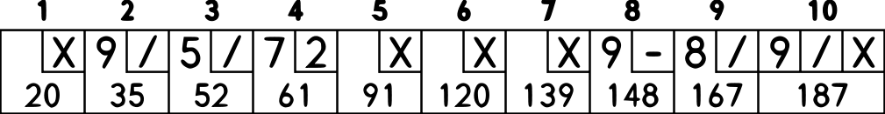
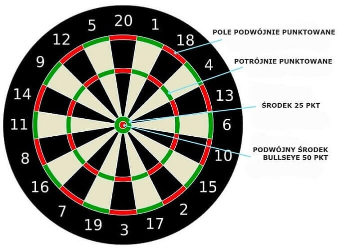

# 07_tdd-tests
[Here is oryginal english version](README.md)

## Bowling Kata

Pomysł tego repozytorium ma zawierać minimalną konfigurację do wykonania słynnego [Uncle Bob](https://twitter.com/unclebobmartin) [Bowling kata](http://butunclebob.com/ArticleS.UncleBob.TheBowlingGameKata)

### Zasady punktacji w grze w Kręgle

Zasady:

Gra składa się z 10 rund, jak pokazano powyżej. W każdej rundzie gracz ma
do dyspozycji dwa rzuty, na strącenie wszystkich 10 kręgli. Wynik dla rundy to suma
przewróconych kręgli plus bonusy za uderzenia i części zamienne.

Tak zwany `spare` jest, gdy gracz powala wszystkie 10 szpilek w dwóch próbach. Bonus dla
ta takiej rundy to liczba kręgli powalonych przy następnym rzucie. A więc w ramce 3
powyżej, wynik wynosi 10 (całkowita liczba odrzuconych) plus premia 5 (
liczba kręgli powalonych przy następnym rzucie)

`Strike` ma miejsce wtedy, gdy gracz przewraca wszystkie 10 kręgli przy pierwszym podejściu. Bonus
dla tej rundy jest wartością dwóch kolejnych rzutów.

W dziesiątej klatce gracz, który rzuca `spare` lub `strike`, może rzucić dodatkowe
kule do uzupełnienia rundy. Jednak nie można wrzucić więcej niż trzech piłek
podczas dziesiątej rundy.

## TDD - krok po kroku

Każdy krok został zacommitowany jako osobny branch:
* [tdd_1](https://github.com/towczare/unit-testing-sda/tree/tdd_1) - testowanie tworzenia nowej gry
* [tdd_2](https://github.com/towczare/unit-testing-sda/tree/tdd_2) - pierwszy test bardzo pechowego gracza, łącznie 0 punktów
* [tdd_3](https://github.com/towczare/unit-testing-sda/tree/tdd_3) - sprawienie aby pierwszy test przechodził
* [tdd_4](https://github.com/towczare/unit-testing-sda/tree/tdd_4) - drugi test, testujący wszystkie rzuty zbijające jednego kręgla, test nie przechodzi
* [tdd_5](https://github.com/towczare/unit-testing-sda/tree/tdd_5) - drugi test przechodzi przez wykonanie najmniejszej możliwej implementacji
* [tdd_6](https://github.com/towczare/unit-testing-sda/tree/tdd_6) - refaktoryzacja kodu
* [tdd_7](https://github.com/towczare/unit-testing-sda/tree/tdd_7) - inne badania testowe są zamienne, na tym etapie nie udaje się
* [tdd_8](https://github.com/towczare/unit-testing-sda/tree/tdd_8) - odkrywamy złe założenia w naszym kodzie, czyniąc krok wstecz, aby go zreorganizować dla naszych celów
* [tdd_9](https://github.com/towczare/unit-testing-sda/tree/tdd_9) - dalsze usprawnienia i kolejne refleksje na temat błędnych założeń
* [tdd_10](https://github.com/towczare/unit-testing-sda/tree/tdd_10) - refaktoryzacja i wdrożenie wymaganej logiki w celu przepuszczenia dodatkowego testu
* [tdd_11](https://github.com/towczare/unit-testing-sda/tree/tdd_11) - wprowadzenie nowego testu strike, na tym etapie nie przechodzi
* [tdd_12](https://github.com/towczare/unit-testing-sda/tree/tdd_12) - wdrożenie logiki strike w celu przejścia nowego testu
* [tdd_13](https://github.com/towczare/unit-testing-sda/tree/tdd_13) - ostateczny efekt refaktoryzacji kodu i dodanie doskonałego testu gry

# ćwiczenie

Korzystając z reguł TDD, spróbuj wdrożyć bardzo podstawową logikę systemu punktacji gry w rzutki `Dart 501`
Oto kilka wymagań, które należy wdrożyć:
- metoda powinna umożliwiać podanie jako parametrów wszystkich możliwych kombinacji rzutów do tarczy, które możesz osiągnąć podczas gry. Przykład:
- `19 POJEDYNCZY`
- `20 TRIPPLE`
- `5 DOUBLE`
- `50 BULLSEYE`
...
- `DartGame` powinien przechowywać aktualny wynik gracza (nowa gra zaczyna się od 501)
- `DartGame` nie powinno pozwalać na odjęcie punktów, gdy 3 rzuty przekraczają wartość posiadanych punktów:
- obecny wynik to `20 punktów`, rzucamy 5 SINGLE, 10 SINGLE, 5 DOUBLE, twoja końcowa punktacja powinna wynosić wciąż 20 punktów
- ostatnie punkty muszą być zdobyte przez rzut typu DOUBLE